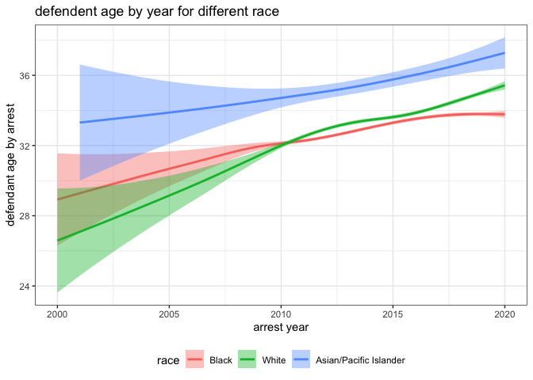

explore\_docket
================

[google
slide](https://docs.google.com/presentation/d/1FM0AUowLZxz42w7CXzi5D0KIjxfEeQarjp_S7hB2Ako/edit)

# load packages and data

``` r
library(tidyverse)
library(lubridate)
load("ddt_tables.Rdata")
rm(ddt_dates, ddt_judicial_districts)
```

# Defendent trends

``` r
range(defendent_info$arrest_age_by_year, na.rm=T)
```

    ## [1]  -1 120

``` r
tmp = defendent_info %>% 
  filter(!is.na(arrest_age_by_year), arrest_age_by_year >= 10, arrest_age_by_year <= 90)

tmp = tmp %>% 
  mutate(age_range = cut(tmp$arrest_age_by_year, seq(10,90,10))) %>% 
  mutate(race = case_when(
    is.na(race) ~ "Unknown/Unreported",
    race=="Asian" ~ "Asian/Pacific Islander",
    T ~ race
  )) %>% 
  filter(!is.na(gender))

tmp = tmp %>% 
  mutate(arrest_year=year(arrest_date))
```

## race - gender

``` r
p <- tmp %>% 
  mutate(race = case_when(
      race %in% c("Native American/Alaskan Native", "Bi-Racial") ~ "Other",
    T ~ race
    )) %>% 
  group_by(gender, race) %>% 
  count() %>% 
ggplot(aes(x=reorder(race,n), y=n)) +
  geom_col(aes(fill=gender), position=position_dodge(0.9)) +
  geom_text(aes(label=n, group=gender), position=position_dodge(0.9), hjust=-0.05) +
  coord_flip() +
  ylab("number of docket cases") +
  xlab("race") + ylim(c(0,2.5e5)) +
  ggtitle("Defendent race and gender trends") +
  theme_bw()

p
```

<!-- -->

``` r
# ggsave("defendent_gender_race.png", p, width=10)
```

## age distribution for race and gender

``` r
# p <- tmp %>% 
#   mutate(race = case_when(
#       race %in% c("Native American/Alaskan Native", "Bi-Racial") ~ "Other",
#     T ~ race
#     )) %>% 
#   group_by(gender, age_range) %>% 
#   count() %>% 
# ggplot(aes(x=age_range, y=n)) +
#   geom_point(aes(color=gender)) +
#   geom_line(aes(group=gender, color=gender)) +
#   ylab("number of docket cases") +
#   xlab("age by arrest (year)") + 
#   ggtitle("Defendent arrest age and gender trends") +
#   theme_bw() +
#   theme(legend.position="bottom")

p <- tmp %>% 
  ggplot(aes(x=arrest_age_by_year)) +
  geom_density(aes(fill=gender, color=gender), alpha=0.2) +
  xlab("age by arrest (year)") + 
  ggtitle("Defendent arrest age and gender trends") +
  theme_bw() +
  theme(legend.position="bottom")
p
```

<!-- -->

``` r
# ggsave("defendent_age_by_gender.png", p)
```

``` r
# p <- tmp %>% 
#   mutate(race = case_when(
#       race %in% c("Native American/Alaskan Native", "Bi-Racial") ~ "Other",
#     T ~ race
#     )) %>% 
#   filter(race != "Unknown/Unreported") %>% 
#   count(race, age_range, name="n") %>% 
#   left_join(
#     tmp %>% 
#   mutate(race = case_when(
#       race %in% c("Native American/Alaskan Native", "Bi-Racial") ~ "Other",
#     T ~ race
#     )) %>% 
#   filter(race != "Unknown/Unreported") %>% 
#   count(race, name="total")
#   ) %>% 
#   mutate(ratio = n/total) %>% 
# ggplot(aes(x=age_range, y=ratio)) +
#   geom_point(aes(color=race)) +
#   geom_line(aes(group=race, color=race)) +
#   ylab("percentage of docket cases in given race") +
#   xlab("age by arrest (year)") + 
#   ggtitle("Defendent arrest age and race trends") +
#   theme_bw() +
#   theme(legend.position="bottom")


p <- tmp %>% 
  mutate(race = case_when(
      race %in% c("Native American/Alaskan Native", "Bi-Racial") ~ "Other",
    T ~ race
    )) %>% 
  filter(race != "Unknown/Unreported") %>% 
  ggplot(aes(x=arrest_age_by_year)) +
  geom_density(aes(color=race, fill=race), alpha=0.2) +
  xlab("age by arrest (year)") + 
  ggtitle("Defendent arrest age and race trends") +
  theme_bw() +
  theme(legend.position="bottom")

p
```

<!-- -->

``` r
# ggsave("defendent_age_by_race.png", p)
```

## age trend across year for gender

In last 20 years.

``` r
lm_m = lm(arrest_age_by_year ~ arrest_year, data = tmp %>% filter(arrest_year >= 2000) )
summary(lm_m)
```

    ## 
    ## Call:
    ## lm(formula = arrest_age_by_year ~ arrest_year, data = tmp %>% 
    ##     filter(arrest_year >= 2000))
    ## 
    ## Residuals:
    ##     Min      1Q  Median      3Q     Max 
    ## -21.303  -9.430  -2.754   7.669  56.119 
    ## 
    ## Coefficients:
    ##               Estimate Std. Error t value Pr(>|t|)    
    ## (Intercept) -4.207e+02  1.240e+01  -33.92   <2e-16 ***
    ## arrest_year  2.254e-01  6.156e-03   36.61   <2e-16 ***
    ## ---
    ## Signif. codes:  0 '***' 0.001 '**' 0.01 '*' 0.05 '.' 0.1 ' ' 1
    ## 
    ## Residual standard error: 11.59 on 369722 degrees of freedom
    ## Multiple R-squared:  0.003612,   Adjusted R-squared:  0.003609 
    ## F-statistic:  1340 on 1 and 369722 DF,  p-value: < 2.2e-16

``` r
lm_m = lm(arrest_age_by_year ~ arrest_year + gender, data = tmp %>% filter(arrest_year >= 2000) )
summary(lm_m)
```

    ## 
    ## Call:
    ## lm(formula = arrest_age_by_year ~ arrest_year + gender, data = tmp %>% 
    ##     filter(arrest_year >= 2000))
    ## 
    ## Residuals:
    ##     Min      1Q  Median      3Q     Max 
    ## -21.335  -9.458  -2.887   7.661  56.318 
    ## 
    ## Coefficients:
    ##               Estimate Std. Error t value Pr(>|t|)    
    ## (Intercept) -4.164e+02  1.239e+01  -33.60   <2e-16 ***
    ## arrest_year  2.238e-01  6.152e-03   36.37   <2e-16 ***
    ## genderMale  -1.206e+00  5.179e-02  -23.29   <2e-16 ***
    ## ---
    ## Signif. codes:  0 '***' 0.001 '**' 0.01 '*' 0.05 '.' 0.1 ' ' 1
    ## 
    ## Residual standard error: 11.58 on 369721 degrees of freedom
    ## Multiple R-squared:  0.005071,   Adjusted R-squared:  0.005066 
    ## F-statistic: 942.2 on 2 and 369721 DF,  p-value: < 2.2e-16

``` r
lm_m = lm(arrest_age_by_year ~ arrest_year + gender + arrest_year * gender, data = tmp %>% filter(arrest_year >= 2000) )
summary(lm_m)
```

    ## 
    ## Call:
    ## lm(formula = arrest_age_by_year ~ arrest_year + gender + arrest_year * 
    ##     gender, data = tmp %>% filter(arrest_year >= 2000))
    ## 
    ## Residuals:
    ##     Min      1Q  Median      3Q     Max 
    ## -22.020  -9.495  -2.989   7.734  56.240 
    ## 
    ## Coefficients:
    ##                          Estimate Std. Error t value Pr(>|t|)    
    ## (Intercept)             -97.84886   31.32562  -3.124  0.00179 ** 
    ## arrest_year               0.06561    0.01555   4.219 2.46e-05 ***
    ## genderMale             -378.86418   34.10694 -11.108  < 2e-16 ***
    ## arrest_year:genderMale    0.18748    0.01693  11.073  < 2e-16 ***
    ## ---
    ## Signif. codes:  0 '***' 0.001 '**' 0.01 '*' 0.05 '.' 0.1 ' ' 1
    ## 
    ## Residual standard error: 11.58 on 369720 degrees of freedom
    ## Multiple R-squared:  0.005401,   Adjusted R-squared:  0.005393 
    ## F-statistic: 669.2 on 3 and 369720 DF,  p-value: < 2.2e-16

``` r
p <- tmp %>% 
  filter(arrest_year >= 2000) %>% 
ggplot(aes(x=arrest_year, y=arrest_age_by_year)) +
  geom_smooth(aes(group=gender, color=gender)) +
  theme_bw() +
  xlab("arrest year") +
  ylab("defendant age by arrest") +
  theme(legend.position = "bottom") +
  ggtitle("defendent age by year for different gender")

p
```

    ## `geom_smooth()` using method = 'gam' and formula 'y ~ s(x, bs = "cs")'

<!-- -->

``` r
# ggsave("defendant_age_by_year.png", p, width=10)
```

## age - year for race

``` r
lm_m = lm(
  arrest_age_by_year ~ arrest_year + race, 
  data = tmp %>% 
    filter(arrest_year >= 2000) %>% 
    filter(race %in% c( "Black", "White","Asian/Pacific Islander")) %>% 
    mutate(race = factor(race, levels = c("Black", "White", "Asian/Pacific Islander"))) 
  )
summary(lm_m)
```

    ## 
    ## Call:
    ## lm(formula = arrest_age_by_year ~ arrest_year + race, data = tmp %>% 
    ##     filter(arrest_year >= 2000) %>% filter(race %in% c("Black", 
    ##     "White", "Asian/Pacific Islander")) %>% mutate(race = factor(race, 
    ##     levels = c("Black", "White", "Asian/Pacific Islander"))))
    ## 
    ## Residuals:
    ##     Min      1Q  Median      3Q     Max 
    ## -20.980  -9.440  -2.881   7.560  55.119 
    ## 
    ## Coefficients:
    ##                              Estimate Std. Error t value Pr(>|t|)    
    ## (Intercept)                -4.456e+02  1.266e+01  -35.20   <2e-16 ***
    ## arrest_year                 2.376e-01  6.285e-03   37.80   <2e-16 ***
    ## raceWhite                   5.099e-01  4.039e-02   12.62   <2e-16 ***
    ## raceAsian/Pacific Islander  2.670e+00  1.629e-01   16.39   <2e-16 ***
    ## ---
    ## Signif. codes:  0 '***' 0.001 '**' 0.01 '*' 0.05 '.' 0.1 ' ' 1
    ## 
    ## Residual standard error: 11.55 on 355877 degrees of freedom
    ## Multiple R-squared:  0.005112,   Adjusted R-squared:  0.005104 
    ## F-statistic: 609.6 on 3 and 355877 DF,  p-value: < 2.2e-16

``` r
p <- tmp %>% filter(arrest_year >= 2000) %>% 
    filter(race %in% c( "Black", "White","Asian/Pacific Islander")) %>% 
    mutate(race = factor(race, levels = c("Black", "White", "Asian/Pacific Islander"))) %>% 
ggplot(aes(x=arrest_year, y=arrest_age_by_year)) +
  geom_smooth(aes(group=race, color=race, fill=race)) +
  theme_bw() +
  xlab("arrest year") +
  ylab("defendant age by arrest") +
  theme(legend.position = "bottom") +
  ggtitle("defendent age by year for different race")

p
```

    ## `geom_smooth()` using method = 'gam' and formula 'y ~ s(x, bs = "cs")'

<!-- -->

``` r
# ggsave("defendant_age_by_year_race.png", p, width=10)
```

## age - year for type of court

``` r
tmp2 = tmp %>% 
left_join(ddt_court_type)
```

    ## Joining, by = "docket_id"

``` r
lm_m = lm(
  arrest_age_by_year ~ arrest_year + court_office_types, 
  data = tmp2 %>% filter(arrest_year >= 2000, court_office_types %in% c("Municipal", "Criminal"))
  )

summary(lm_m)
```

    ## 
    ## Call:
    ## lm(formula = arrest_age_by_year ~ arrest_year + court_office_types, 
    ##     data = tmp2 %>% filter(arrest_year >= 2000, court_office_types %in% 
    ##         c("Municipal", "Criminal")))
    ## 
    ## Residuals:
    ##     Min      1Q  Median      3Q     Max 
    ## -21.296  -9.329  -2.970   7.447  57.324 
    ## 
    ## Coefficients:
    ##                               Estimate Std. Error t value Pr(>|t|)    
    ## (Intercept)                 -4.202e+02  9.953e+00  -42.22   <2e-16 ***
    ## arrest_year                  2.245e-01  4.941e-03   45.44   <2e-16 ***
    ## court_office_typesMunicipal  1.192e+00  3.109e-02   38.34   <2e-16 ***
    ## ---
    ## Signif. codes:  0 '***' 0.001 '**' 0.01 '*' 0.05 '.' 0.1 ' ' 1
    ## 
    ## Residual standard error: 11.48 on 585588 degrees of freedom
    ## Multiple R-squared:  0.006268,   Adjusted R-squared:  0.006265 
    ## F-statistic:  1847 on 2 and 585588 DF,  p-value: < 2.2e-16

``` r
tmp2 %>% 
  filter(arrest_year >= 2000) %>% 
  ggplot(aes(x=arrest_year, y=arrest_age_by_year)) +
  geom_smooth(aes(group=court_types, color=court_types, fill=court_types)) +
  theme_bw() +
  xlab("arrest year") +
  ylab("defendant age by arrest") +
  theme(legend.position = "bottom") +
  ggtitle("defendent age by year")
```

    ## `geom_smooth()` using method = 'gam' and formula 'y ~ s(x, bs = "cs")'

<!-- -->

``` r
lm_m = lm(
  arrest_age_by_year ~ arrest_year + court_types, 
  data = tmp2 %>% filter(arrest_year >= 2000)
  )

summary(lm_m)
```

    ## 
    ## Call:
    ## lm(formula = arrest_age_by_year ~ arrest_year + court_types, 
    ##     data = tmp2 %>% filter(arrest_year >= 2000))
    ## 
    ## Residuals:
    ##     Min      1Q  Median      3Q     Max 
    ## -21.275  -9.339  -2.963   7.423  57.310 
    ## 
    ## Coefficients:
    ##                  Estimate Std. Error t value Pr(>|t|)    
    ## (Intercept)    -4.299e+02  9.866e+00 -43.568   <2e-16 ***
    ## arrest_year     2.293e-01  4.899e-03  46.813   <2e-16 ***
    ## court_typesMC   1.191e+00  3.105e-02  38.352   <2e-16 ***
    ## court_typesPAC -1.132e-01  9.534e-02  -1.187    0.235    
    ## ---
    ## Signif. codes:  0 '***' 0.001 '**' 0.01 '*' 0.05 '.' 0.1 ' ' 1
    ## 
    ## Residual standard error: 11.47 on 601149 degrees of freedom
    ## Multiple R-squared:  0.006583,   Adjusted R-squared:  0.006578 
    ## F-statistic:  1328 on 3 and 601149 DF,  p-value: < 2.2e-16

``` r
tmp2 = tmp %>% 
left_join(ddt_court_type)
```

    ## Joining, by = "docket_id"

``` r
lm_m = lm(
  arrest_age_by_year ~ arrest_year*court_office_types, 
  data = tmp2 %>% filter(arrest_year >= 2000, court_office_types %in% c("Municipal", "Criminal"))
  )

summary(lm_m)
```

    ## 
    ## Call:
    ## lm(formula = arrest_age_by_year ~ arrest_year * court_office_types, 
    ##     data = tmp2 %>% filter(arrest_year >= 2000, court_office_types %in% 
    ##         c("Municipal", "Criminal")))
    ## 
    ## Residuals:
    ##     Min      1Q  Median      3Q     Max 
    ## -21.280  -9.351  -2.965   7.432  57.345 
    ## 
    ## Coefficients:
    ##                                           Estimate Std. Error t value Pr(>|t|)
    ## (Intercept)                             -4.056e+02  1.690e+01 -24.004   <2e-16
    ## arrest_year                              2.173e-01  8.391e-03  25.898   <2e-16
    ## court_office_typesMunicipal             -2.105e+01  2.091e+01  -1.007    0.314
    ## arrest_year:court_office_typesMunicipal  1.104e-02  1.038e-02   1.064    0.288
    ##                                            
    ## (Intercept)                             ***
    ## arrest_year                             ***
    ## court_office_typesMunicipal                
    ## arrest_year:court_office_typesMunicipal    
    ## ---
    ## Signif. codes:  0 '***' 0.001 '**' 0.01 '*' 0.05 '.' 0.1 ' ' 1
    ## 
    ## Residual standard error: 11.48 on 585587 degrees of freedom
    ## Multiple R-squared:  0.00627,    Adjusted R-squared:  0.006265 
    ## F-statistic:  1232 on 3 and 585587 DF,  p-value: < 2.2e-16

``` r
p <- tmp2 %>% 
  filter(arrest_year >= 2000, court_office_types %in% c("Municipal", "Criminal")) %>% 
  ggplot(aes(x=arrest_year, y=arrest_age_by_year)) +
  geom_smooth(aes(group=court_office_types, color=court_office_types, fill=court_office_types)) +
  theme_bw() +
  xlab("arrest year") +
  ylab("defendant age by arrest") +
  theme(legend.position = "bottom") +
  ggtitle("defendent age by year for different office types")
  

ggsave("defendant_age_by_year_officeTypes.png", p, width=10)
```

    ## Saving 10 x 5 in image

    ## `geom_smooth()` using method = 'gam' and formula 'y ~ s(x, bs = "cs")'

# offense

``` r
offense <- vroom::vroom(
  "https://storage.googleapis.com/jat-rladies-2021-datathon/offenses_dispositions.csv", col_select = c("docket_id", "grade", "sentence_type", "min_period", "max_period")
) %>% distinct() %>% 
  filter(!is.na(grade), grade!="1")
```

    ## Warning: One or more parsing issues, see `problems()` for details

## grade

``` r
offense_grade = offense %>% mutate(
  grade_type = case_when(
    str_starts(grade, "F") ~ "Felony",
    str_starts(grade, "M") ~ "Misdemeanor",
    str_starts(grade, "H") ~ "Homicide",
    str_starts(grade, "S") ~ "Summary"
  )) %>% select(docket_id, grade_type) %>% 
  filter(!is.na(grade_type)) %>% 
    distinct()
```
