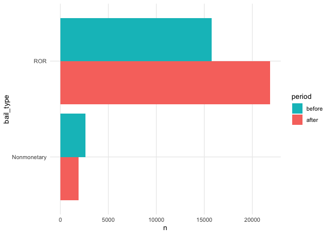
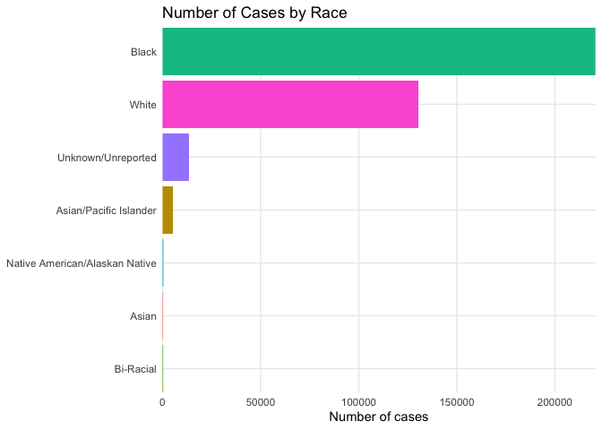
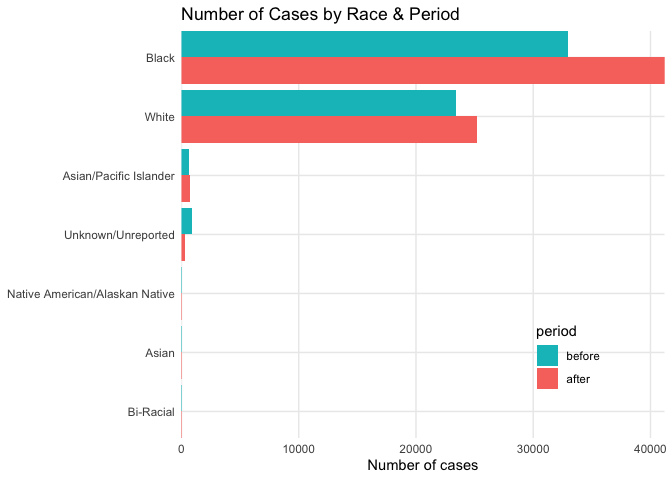
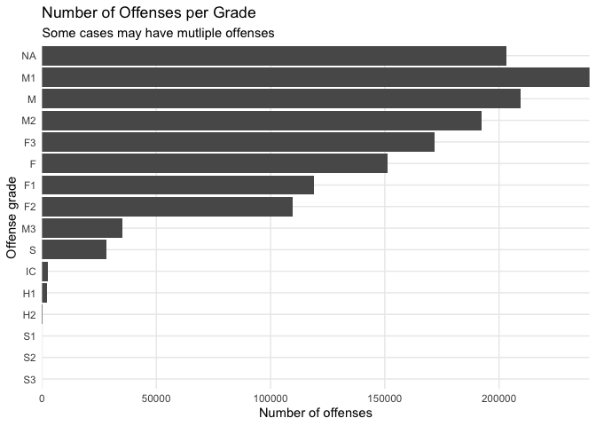
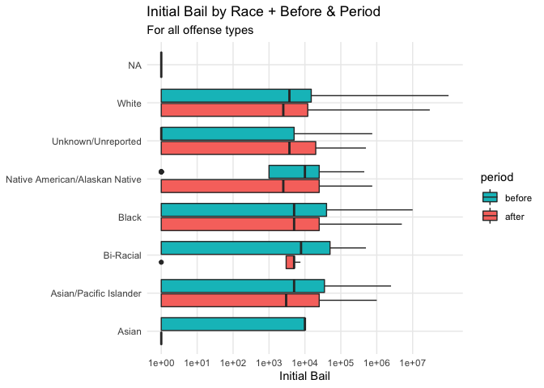
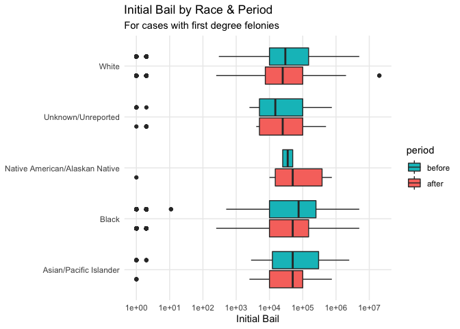

Bail Race
================
Katrina Gutierrez, Trang Le, Jake Riley
3/29/2021

Purpose of this file:

-   explore bail data issues (multiple initial bail amounts and multiple
    judges)
-   merge bail with defendant and offenses data
-   look at bail trends disaggretated by race and the grade of the
    offense

## Outstanding questions

-   How should we choose initial bail when there are two different
    values for bail in the first action date?
-   If we choose to consider offense severity alongside bail, how should
    we deal with cases that have multiple offense grades?  
-   When plotting initial bail vs race, how should I use scale\_y\_log10
    when some bail amounts are zero?
-   What does a zero value for bail actually mean?

*Possible areas for future exploration*

-   Trends for gender and age
-   Trends for judge actions (and how do we actually approach this?)

## Initial set-up

Loading libraries

``` r
library(tidyverse)
```

    ## ── Attaching packages ─────────────────────────────────────── tidyverse 1.3.0 ──

    ## ✓ ggplot2 3.3.2     ✓ purrr   0.3.4
    ## ✓ tibble  3.0.4     ✓ dplyr   1.0.4
    ## ✓ tidyr   1.1.2     ✓ stringr 1.4.0
    ## ✓ readr   1.4.0     ✓ forcats 0.5.0

    ## ── Conflicts ────────────────────────────────────────── tidyverse_conflicts() ──
    ## x dplyr::filter() masks stats::filter()
    ## x dplyr::lag()    masks stats::lag()

``` r
library(lubridate)
```

    ## 
    ## Attaching package: 'lubridate'

    ## The following objects are masked from 'package:base':
    ## 
    ##     date, intersect, setdiff, union

``` r
library(DataExplorer)
library(vroom)

theme_set(theme_minimal())
theme_update(panel.grid.minor = element_blank())
```

Loading the full datasets (all years):

-   bail: each record is an action related to bail; each docket\_id can
    have multiple actions
-   off\_raw: offense and disposition data; each record is an
    offense/disposition; each docket\_id can have multiple offenses
-   def\_raw: defendent docket data; each record is one
    defendent/docket\_id; each docket\_id has one defendent

``` r
larry_date <- as.Date("2018-01-02")
start_period_1 <- larry_date - period(2, "years")
end_period_2 <- larry_date + period(2, "years")
dat_dir <- "csv"

bail_raw <- vroom::vroom(file.path(dat_dir, "bail.csv"))
```

    ## Rows: 8,445,136
    ## Columns: 10
    ## Delimiter: ","
    ## chr  [6]: action_type_name, type_name, registry_entry_code, participant_name__title, par...
    ## dbl  [3]: docket_id, percentage, total_amount
    ## date [1]: action_date
    ## 
    ## Use `spec()` to retrieve the guessed column specification
    ## Pass a specification to the `col_types` argument to quiet this message

``` r
off_raw <- vroom::vroom(file.path(dat_dir, "offenses_dispositions.csv")) %>%
  mutate(
    grade =
      grade %>% # forcats will default to alpha order
        fct_relevel("H1", "H2", after = 0) %>% # move these to the front
        fct_relevel("IC", after = Inf) %>% # move this to the back
        fct_rev() %>%
        factor(ordered = TRUE)
  )
```

    ## Rows: 1,465,113
    ## Columns: 16
    ## Delimiter: ","
    ## chr [14]: description, statute_description, grade, disposition, disposing_authority__first...
    ## dbl [ 2]: docket_id, sequence_number
    ## 
    ## Use `spec()` to retrieve the guessed column specification
    ## Pass a specification to the `col_types` argument to quiet this message

``` r
def_raw <- vroom::vroom(file.path(dat_dir, "defendant_docket_details.csv")) %>%
  replace_na(list(race = "Unknown/Unreported"))
```

    ## Rows: 370,313
    ## Columns: 19
    ## Delimiter: ","
    ## chr  [11]: gender, race, status_name, court_office__court__display_name, current_processin...
    ## dbl  [ 1]: docket_id
    ## date [ 7]: date_of_birth, arrest_date, complaint_date, disposition_date, filing_date, init...
    ## 
    ## Use `spec()` to retrieve the guessed column specification
    ## Pass a specification to the `col_types` argument to quiet this message

## Cleaning Bail Data

An initial look at the bail data

``` r
glimpse(bail_raw)
```

    ## Rows: 8,445,136
    ## Columns: 10
    ## $ docket_id                    <dbl> 351349, 161450, 286894, 357646, 166821, …
    ## $ action_date                  <date> 2016-08-01, 2017-03-01, 2020-01-01, 201…
    ## $ action_type_name             <chr> "Increase Bail Amount", "Set", "Revoke",…
    ## $ type_name                    <chr> "Monetary", "Monetary", "Monetary", "Mon…
    ## $ percentage                   <dbl> 10, 10, 10, 10, 10, NA, 10, 10, 10, 10, …
    ## $ total_amount                 <dbl> 1300, 175000, 750000, 350000, 300000, 37…
    ## $ registry_entry_code          <chr> "Order Granting Motion for Continuance",…
    ## $ participant_name__title      <chr> "Judge", "Judge", "Judge", "Judge", "Jud…
    ## $ participant_name__last_name  <chr> "Tucker", "McCaffery", "Perez", "Campbel…
    ## $ participant_name__first_name <chr> "Leon", "Daniel", "Mia", "Giovanni", "Ti…

Since I want to get initial bail for each docket\_id and there are many
actions for a given date (month), I want “Set” to be the first action
type for each date when I sort the data later. Therefore, I made the
variable action\_type\_name into a factor and put “Set” as the first
level.

Even if “Set” is not in the first month, we will still be able to get
whatever bail amount is included in the first month.

### Initial Cleaning Actions

-   filtered for participant title “Judge”
-   created a variable “judge” with the first and last name
-   converted action\_date to a date type
-   sorted by docket\_id, then action\_date, and then action\_type\_name

``` r
bail <- bail_raw %>%
  # releveling action_type_name so that "Set" comes first
  mutate(action_type_name = action_type_name %>%
    as.factor() %>%
    relevel(ref = "Set")) %>%
  filter(
    participant_name__title == "Judge",
    !is.na(participant_name__first_name)
  ) %>%
  mutate(
    judge = paste(
      participant_name__last_name,
      participant_name__first_name,
      sep = ","
    ),
    action_date = ymd(action_date),
    action_type_name = factor(action_type_name)
  )

# checking the levels for action_type_name
levels(bail$action_type_name)
```

    ##  [1] "Set"                            "Bail Forfeiture Set Aside"     
    ##  [3] "Bond Terminated"                "Change Bail Percentage"        
    ##  [5] "Change Bail Type"               "Change Non-Monetary Conditions"
    ##  [7] "Decrease Bail Amount"           "Denied"                        
    ##  [9] "Deny (bail modification)"       "Forfeiture - Complete"         
    ## [11] "Forfeiture - Partial"           "Increase Bail Amount"          
    ## [13] "Reinstate"                      "Revoke"                        
    ## [15] "Revoke and Forfeit"             "Set (bail modification)"

Exploring cases where initial bail is $0:

-   Most of these cases (75%) were “ROR” (Release on Own Recognizance).
    Defendants were released with no bail (there could be some
    conditions placed).
-   22% of cases were “Nonmonetary” for the bail type. This means
    nonmonetary conditions were applied to their release. Nonmonetary
    conditions can also be applied on top of monetary bail.  
-   When there is an NA value for bail type this means the bail was
    denied. All the action\_type\_name values were “Denied” when there
    was an NA for bail type.

``` r
# Looking at bail type for cases with $0 initial bail
bail_zero <- bail %>%
  mutate(period = case_when(
    between(action_date, start_period_1, larry_date) ~ "before",
    between(action_date, larry_date, end_period_2) ~ "after",
    TRUE ~ NA_character_
  )) %>%
  filter(total_amount == 0) %>%
  group_by(docket_id, period) %>%
  summarise(bail_type = first(type_name), .groups = "drop") %>%
  group_by(bail_type, period) %>%
  summarise(n = length(bail_type), .groups = "drop") %>%
  mutate(proportion = round(n / sum(n), 3)) %>%
  drop_na(bail_type) %>%
  filter(n > 10)

head(bail_zero)
```

    ## # A tibble: 6 x 4
    ##   bail_type   period     n proportion
    ##   <chr>       <chr>  <int>      <dbl>
    ## 1 Monetary    <NA>      73      0.001
    ## 2 Nonmonetary after   1891      0.017
    ## 3 Nonmonetary before  2615      0.023
    ## 4 Nonmonetary <NA>   20924      0.183
    ## 5 ROR         after  21873      0.192
    ## 6 ROR         before 15766      0.138

``` r
# looking at NA values for bail type - they tend to occur when bail is denied
bail_zero_NA <- bail %>%
  filter(total_amount == 0 & is.na(type_name))

unique(bail_zero_NA$action_type_name)
```

    ## [1] Denied
    ## 16 Levels: Set Bail Forfeiture Set Aside ... Set (bail modification)

``` r
bail_zero %>%
  drop_na(period) %>%
  ggplot(aes(x = n, y = bail_type, fill = period)) +
  geom_col(position = "dodge") +
  guides(fill = guide_legend(reverse = TRUE))
```

<!-- -->

The action date column uses the first day of the month, so it is
difficult to determine the order of events that occurred within the same
month.

It is also difficult to determine what the initial bail is if there are
multiple values for bail in the first month.

To explore this issue, I first looked at how many bail amounts were
associated with a given action date and action type for each docket. In
most cases, there was only one value for bail for a given action date +
action type + docket id. However, in some cases there were up to 3
different bail amounts in the same month for a docket, and these also
had the same action type.

``` r
# Grouped the bail data to see the number unique bail amounts associated with a given docket_id + action_date + action_type_name

system.time(
  bail_amounts_per_docket <- bail %>%
    group_by(docket_id, action_date, action_type_name) %>%
    summarise(
      n_bail_vals = length(unique(total_amount)),
      .groups = "drop"
    )
)
```

    ##    user  system elapsed 
    ##  14.779   0.165   4.577

``` r
# Usually there is only one value for bail, but sometimes there's up to 3.
# Unclear which would come first in those cases.
summary(bail_amounts_per_docket$n_bail_vals)
```

    ##    Min. 1st Qu.  Median    Mean 3rd Qu.    Max. 
    ##   1.000   1.000   1.000   1.002   1.000   3.000

Since I wanted initial bail for each docket, I looked at how severe this
issue was for the first action date in particular per docket.

Most dockets had only one value for bail amount for the “Set” type of
actions in the first month. However, there were a few that had 2
different bail amounts in the first month and both with a “Set” action
type.

``` r
# Grouping the result of the previous test by docket_id to see what is happening for the first action date.
# The data was already sorted by action date previously and with action type "Set" at the top for each date.
test2 <- bail_amounts_per_docket %>%
  group_by(docket_id) %>%
  summarise(
    first_bail_vals = first(n_bail_vals)
  )

# For the first action date, there is usually only one value for bail.
# But sometimes there are two.
summary(test2$first_bail_vals)
```

    ##    Min. 1st Qu.  Median    Mean 3rd Qu.    Max. 
    ##   1.000   1.000   1.000   1.001   1.000   2.000

Next, I wanted a better understanding of how frequently there are two
different bail values being set in first month.

It turns out this issue is pretty rare. Meaning, there are 188
docket\_ids (0.054% of cases for all years) where there are two bail
values to choose from for initial bail.

``` r
# filters the previous results for dockets with more than one value for bail in the first month
test3 <- test2 %>%
  ungroup() %>%
  filter(first_bail_vals > 1)

# Creates a list of the docket ids fitting this criteria
mult_inital_bail <- unique(test3$docket_id)

# This issue rare:  188 docket ids for all years
length(mult_inital_bail)
```

    ## [1] 188

``` r
# In other words, 0.054% of cases for all years
length(mult_inital_bail) / length(unique(bail$docket_id))
```

    ## [1] 0.0005407644

Here, we take a look at some of the dockets that have two bail values in
the first month. It’s unclear which value would be first.

*We still need to figure out what to do about these cases*

``` r
# filters data for docket ids that have more than one bail value in the first month based off the previous code cell
mult_inital_bail_data <- bail %>% filter(docket_id %in% mult_inital_bail)
head(mult_inital_bail_data)
```

    ## # A tibble: 6 x 11
    ##   docket_id action_date action_type_name type_name percentage total_amount
    ##       <dbl> <date>      <fct>            <chr>          <dbl>        <dbl>
    ## 1    162853 2017-01-01  Set              Monetary          10       175000
    ## 2    155853 2017-10-01  Set              Monetary          10       300000
    ## 3    154545 2017-08-01  Set              Monetary          10       600000
    ## 4    283779 2018-02-01  Set              Monetary          10       400000
    ## 5    282994 2019-09-01  Change Bail Type Monetary          10       300000
    ## 6    283779 2018-02-01  Set              Monetary          10       400000
    ## # … with 5 more variables: registry_entry_code <chr>,
    ## #   participant_name__title <chr>, participant_name__last_name <chr>,
    ## #   participant_name__first_name <chr>, judge <chr>

Creating a dataset where each record is a docket\_id with summary bail
info like:

-   number of unique judges associated with the case
-   minimum/maximum bail ever set during the case
-   first and last bail amount set + the dates

``` r
# grouping and summarizing the data, such that we have one record per docket_id for bail
bail_grouped <- bail %>%
  group_by(docket_id) %>%
  summarise(
    n_judges = length(unique(judge)),
    min_bail = min(total_amount),
    max_bail = max(total_amount),
    date_first_bail = first(action_date),
    first_bail = first(total_amount),
    date_last_bail = last(action_date),
    last_bail = last(total_amount)
  )
```

Now, I’ll take a quick look at the distribution of the number of judges
per case. While most cases have less than 5 judges, there can be up to
20.

``` r
summary(bail_grouped$n_judges)
```

    ##    Min. 1st Qu.  Median    Mean 3rd Qu.    Max. 
    ##   1.000   1.000   2.000   2.712   3.000  20.000

It’s difficult to understand what each judge has done for each docket
because all of the judges that are involved are connected with each
action date, type, and corresponding bail amount.

So for example, if we wanted to look at action type “Increase Bail
Amount” on day X for docket Y, we would see all of the judges associated
with docket Y for that action.

``` r
# grouping the data such that we can see how many unique judges are associated with a particular action type and amount of bail within one action date per docket

joined_judge <- bail %>%
  group_by(docket_id) %>%
  # getting the number of unique judges for each docket
  mutate(n_judges2 = length(unique(judge))) %>%
  group_by(docket_id, action_date, action_type_name, total_amount, n_judges2) %>%
  summarise(n_judges = length(unique(judge)), .groups = "drop") %>%
  mutate(same = n_judges == n_judges2)

# it turns out that for all action types for each date within a docket, it has all the judges associated with the docket in general (because all the values are ones)
summary(joined_judge$same)
```

    ##    Mode    TRUE 
    ## logical  545487

If we were to look at the actions on an even more granular level with
the registry entry code (for the same docket, date, action type, bail
amount), we would find different judges associated with different values
of registry entry code. Usually, at this granular level, there is only
one judge associated with each registry entry code, but there can be up
to 17.

I’m not sure how useful this granular data is though because there are
1508 registry entry codes, and I don’t know what exactly they mean.

``` r
# there are 1508 different registry entry codes
length(unique(bail$registry_entry_code))
```

    ## [1] 1508

``` r
judge_grouped3 <- bail %>%
  group_by(docket_id, action_date, action_type_name, total_amount, registry_entry_code) %>%
  summarise(
    n_judges = length(unique(judge))
  )
```

    ## `summarise()` has grouped output by 'docket_id', 'action_date', 'action_type_name', 'total_amount'. You can override using the `.groups` argument.

``` r
# most of the time only one judge is associated with one registry entry code, but there can be up to 17 judges
summary(judge_grouped3$n_judges)
```

    ##    Min. 1st Qu.  Median    Mean 3rd Qu.    Max. 
    ##   1.000   1.000   1.000   1.167   1.000  17.000

Since some cases have multiple judges and it’s difficult to distinguish
their involvement, it’s difficult to look at bail trends with judges.

## Defendent Data

For the defendant data, each unique docket\_id is associated with one
record. However, there’s more docket ids in the defendant data than we
have for bail.

``` r
# number of records in defendant data = number of unique docket ids
nrow(def_raw) == length(unique(def_raw$docket_id))
```

    ## [1] TRUE

``` r
length(unique(def_raw$docket_id)) # number of docket ids for defendant data
```

    ## [1] 370313

``` r
length(unique(bail_grouped$docket_id)) # number of docket ids for bail data
```

    ## [1] 347656

An overview of the defendant data

``` r
glimpse(def_raw)
```

    ## Rows: 370,313
    ## Columns: 19
    ## $ docket_id                                         <dbl> 354343, 347123, 355…
    ## $ gender                                            <chr> "Male", "Male", "Fe…
    ## $ race                                              <chr> "White", "Black", "…
    ## $ date_of_birth                                     <date> 1976-01-01, 1964-0…
    ## $ arrest_date                                       <date> 2016-03-01, 2016-0…
    ## $ complaint_date                                    <date> NA, NA, NA, NA, NA…
    ## $ disposition_date                                  <date> NA, NA, NA, NA, NA…
    ## $ filing_date                                       <date> 2016-03-01, 2016-0…
    ## $ initiation_date                                   <date> 2016-03-01, 2016-0…
    ## $ status_name                                       <chr> "Inactive", "Inacti…
    ## $ court_office__court__display_name                 <chr> "Municipal Court - …
    ## $ current_processing_status__processing_status      <chr> NA, NA, NA, NA, NA,…
    ## $ current_processing_status__status_change_datetime <date> 0001-01-01, 0001-0…
    ## $ municipality__name                                <chr> "Philadelphia City"…
    ## $ municipality__county__name                        <chr> "Philadelphia", "Ph…
    ## $ judicial_districts                                <chr> "Philadelphia", "Ph…
    ## $ court_office_types                                <chr> "Municipal", "Munic…
    ## $ court_types                                       <chr> "MC", "MC", "MC", "…
    ## $ representation_type                               <chr> "Prosecutor, Public…

Overview of frequency of cases per race.

I recognize this is not the prettiest graph, but I have a feeling the
team looking at defendant data has more graphs and insights.

Regardless, most cases have either black or white defendants, so I chose
to compare black and white in my analysis later.

``` r
def_race <- def_raw %>%
  mutate(period = case_when(
    between(filing_date, start_period_1, larry_date) ~ "before",
    between(filing_date, larry_date, end_period_2) ~ "after",
    TRUE ~ NA_character_
  )) %>%
  count(race, period, name = "n_cases")

# plots a bar chart with the number of cases per offense grade
def_race %>%
  ggplot(aes(
    x = n_cases, fill = race,
    y = fct_reorder(race, n_cases)
  )) +
  geom_col() +
  labs(
    title = "Number of Cases by Race",
    y = NULL, x = "Number of cases"
  ) +
  guides(fill = FALSE) +
  coord_cartesian(expand = FALSE)
```

<!-- -->

``` r
def_race %>%
  drop_na(period) %>%
  ggplot(aes(
    x = n_cases, fill = period,
    y = fct_reorder(race, n_cases)
  )) +
  geom_col(position = "dodge") +
  labs(
    title = "Number of Cases by Race & Period",
    y = NULL, x = "Number of cases"
  ) +
  guides(fill = guide_legend(reverse = TRUE)) +
  coord_cartesian(expand = FALSE) +
  theme(legend.position = c(0.8, 0.2))
```

<!-- -->

I pulled a subset of the defendant data with the variables I was
interested in: docket\_id, gender, race, and DOB.

``` r
def_subset <- def_raw %>% select(docket_id, gender, race, date_of_birth)
```

## Offenses Data

Overview of offense data

``` r
glimpse(off_raw)
```

    ## Rows: 1,465,113
    ## Columns: 16
    ## $ docket_id                          <dbl> 18522, 198854, 216257, 217440, 447…
    ## $ description                        <chr> "Theft By Unlaw Taking-Immovable P…
    ## $ statute_description                <chr> "Theft By Unlaw Taking-Immovable P…
    ## $ sequence_number                    <dbl> 68, 17, 13, 13, 13, 35, 35, 15, 19…
    ## $ grade                              <ord> F3, F3, F3, F3, M3, F2, F2, F1, F3…
    ## $ disposition                        <chr> "Guilty Plea - Non-Negotiated", "G…
    ## $ disposing_authority__first_name    <chr> "Nina", "Ellen", "Earl", "Lillian"…
    ## $ disposing_authority__middle_name   <chr> "N.", NA, "W.", NA, NA, "Scott", "…
    ## $ disposing_authority__last_name     <chr> "Wright Padilla", "Ceisler", "Tren…
    ## $ disposing_authority__title         <chr> "Judge", "Judge", "Senior Judge", …
    ## $ disposing_authority__document_name <chr> "Nina N. Wright Padilla", "Ellen C…
    ## $ disposition_method                 <chr> NA, NA, NA, NA, "Non-Jury Trial", …
    ## $ min_period                         <chr> NA, NA, "3.00 Years and 6.00 Month…
    ## $ max_period                         <chr> "7.00 Years", "4.00 Years", "7.00 …
    ## $ period                             <chr> "7 years", "4 years", "3 1/2 to 7 …
    ## $ sentence_type                      <chr> "Probation", "Probation", "Confine…

I’m still wondering what the best way is to merge the offenses data with
the bail data.

For this, I was primarily interested in the “grade” of the offense
(i.e. first degree felony - F1). - H = murder (I confirmed this by spot
checking records) - F = felony - M = misdemeanor

It’s a bit challenging to look at the grade of the offense because some
dockets have multiple offenses. It’s also difficult to rank the offenses
by level of severity because some of them don’t come with a degree For
example, I wouldn’t know how to rank “F” vs “F3”. There’s also some
grades that weren’t included in the ranking system we were provided,
such as IC, S, S1, S2, or S3. Also, sometimes there is no grade
assigned.

We could also wait until the team who worked with the offense data
shares their cleaned data files, and then after that we can merge bail
with the offense data.

``` r
# all the grades for offenses
unique(off_raw$grade)
```

    ##  [1] F3   M3   F2   F1   M2   M1   S    <NA> M    H1   H2   F    IC   S1   S2  
    ## [16] S3  
    ## 15 Levels: IC < S3 < S2 < S1 < S < M3 < M2 < M1 < M < F3 < F2 < F1 < ... < H1

``` r
length(unique(off_raw$grade)) # number of grade types
```

    ## [1] 16

I decided to conduct a preliminary approach at getting the most severe
grade/offense, since this one would likely have the biggest impact on
bail.

I put the grades in order as H, F, M, S, then IC. I also put things
order by degree, with grades without a degree last.

An issue with this approach is that a grade without a degree may not
actually be less severe than a grade with a degree. Also, I’m not sure
what S and IC signify, so I’m not sure which would be more severe than
the other.

With just a preliminary look at the offense data, there’s quite a few
offenses with no grade. There’s also quite a few offenses that have just
a letter for the grade but no degree.

Once again, the team looking at the offense data will probably have more
plots and insights.

``` r
offense_grade <- off_raw %>%
  group_by(grade) %>%
  summarise(n_offenses = length(grade))

# plots a bar chart with the number of cases per offense grade
offense_grade %>%
  ggplot(aes(
    x = n_offenses,
    y = fct_reorder(grade, n_offenses)
  )) +
  geom_col() +
  labs(
    title = "Number of Offenses per Grade",
    x = "Number of offenses", y = "Offense grade",
    subtitle = "Some cases may have mutliple offenses"
  ) +
  coord_cartesian(expand = FALSE)
```

<!-- -->

Creating a dataset grouped by docket id with the each case’s most
serious offense + number of offenses.

``` r
# grouping the data, such that we will have one record per docket_id for offenses
offense_grouped <- off_raw %>%
  filter(!is.na(grade)) %>%
  group_by(docket_id) %>%
  summarise(
    n_offenses = length(grade),
    most_ser_off = max(unique(grade))
  )
```

## Merging Bail with Defendent and Offense Data

Merging the grouped data from bail with the defendent data and then the
grouped offenses data. This produces a dataset with one record per
docket\_id.

Upon merging, there’s only missing values for most\_ser\_off. It makes
sense that there are missing values for this variable because we saw
that in the original offenses dataset; some cases did not have grades
for offenses.

``` r
joined <- bail_grouped %>%
  left_join(def_subset, by = "docket_id") %>%
  left_join(offense_grouped, by = "docket_id")

# checking for missing data in the joined dataset
DataExplorer::plot_missing(joined)
```

<!-- -->

## Considering “Before” and “After”

Creating a subset of the data within 2016-2019 for two years before
(2016-2017) and after (2016-2017) the new DA started. I also added dummy
variables for before and after.

``` r
joined16_19 <- joined %>%
  mutate(period = case_when(
    between(date_first_bail, start_period_1, larry_date) ~ "before",
    between(date_first_bail, larry_date, end_period_2) ~ "after",
    TRUE ~ NA_character_
  )) %>%
  filter(!is.na(period))
```

## Bail by Race

Looking at trends in initial bail by race.

I focused on black and white because the other races were appeared
infrequently relatively.

Data below considers for all offense types.

Creating a box plot of initial bail by race, considering before and
after for all charge types.

scale\_y\_log10 was giving me issues because there are some bail values
of zero. I added 1 to all the bail values to address this, but I’m
wondering if there was a better solution.

``` r
# box plot of initial bail by race - before and after - all offense types
joined16_19 %>%
  # added 1 to first bail so we can use zero values when we log transform
  mutate(first_bail = first_bail + 1) %>%
  ggplot(aes(y = race, x = first_bail, fill = period)) +
  geom_boxplot() +
  labs(
    title = "Initial Bail by Race + Before & Period",
    x = "Initial Bail", subtitle = "For all offense types",
    y = NULL
  ) +
  guides(fill = guide_legend(reverse = TRUE)) +
  scale_x_log10(limits = c(1, NA), breaks = 10^(0:7))
```

<!-- -->

Data below filters for first degree felonies (F1) as the most serious
offense grade. I chose to filter by F1 because it is the most severe
grade after murder (and cases of murder occurred infrequently). Based
off the way I ranked offense grades, F1 is among the more likely to be
accurately ranked in severity.

``` r
# box plot of initial bail by race - before and after - offense grade F1 only

joined16_19 %>%
  # added 1 to first bail so we can use zero values when we log transform
  mutate(first_bail = first_bail + 1) %>%
  filter(most_ser_off == "F1") %>%
  ggplot(aes(y = race, x = first_bail, fill = period)) +
  geom_boxplot() +
  labs(
    title = "Initial Bail by Race & Period",
    x = "Initial Bail", subtitle = "For cases with first degree felonies",
    y = NULL
  ) +
  guides(fill = guide_legend(reverse = TRUE)) +
  scale_x_log10(limits = c(1, NA), breaks = 10^(0:7)) +
  NULL
```

<!-- -->
