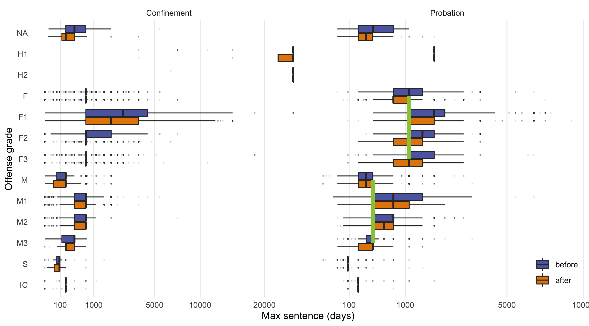

Trends in max sentencing
================

In this notebook, we try to answer the question: On average, did the
maximum sentencing for probation change after Larry Krasner took office?

``` r
library(tidyverse)
library(lubridate)
source("ec_functions.R")
theme_set(theme_minimal())
theme_update(panel.grid.minor = element_blank())

set.seed(1)
```

``` r
dispositions <- read_csv("../../data/offenses_dispositions_v3.csv",
  col_types = cols(
    docket_id = col_double(),
    description = col_character(),
    statute_description = col_character(),
    statute_name = col_character(),
    sequence_number = col_double(),
    grade = col_character(),
    disposition = col_character(),
    disposing_authority__first_name = col_character(),
    disposing_authority__middle_name = col_character(),
    disposing_authority__last_name = col_character(),
    disposing_authority__title = col_character(),
    disposing_authority__document_name = col_character(),
    disposition_method = col_character(),
    min_period = col_character(),
    max_period = col_character(),
    period = col_character(),
    credit = col_double(),
    sentence_type = col_character()
  )
)

dat_dir <- "csv"
def_raw <- vroom::vroom(file.path(dat_dir, "defendant_docket_details.csv")) %>%
  replace_na(list(race = "Unknown/Unreported"))
```

    ## Rows: 370,313
    ## Columns: 19
    ## Delimiter: ","
    ## chr  [11]: gender, race, status_name, court_office__court__display_name, current_processin...
    ## dbl  [ 1]: docket_id
    ## date [ 7]: date_of_birth, arrest_date, complaint_date, disposition_date, filing_date, init...
    ## 
    ## Use `spec()` to retrieve the guessed column specification
    ## Pass a specification to the `col_types` argument to quiet this message

``` r
# Helper function. Returns NA for x that don't conform to the pattern
units_to_days <- function(period) {
  duration_match <- stringr::str_match(
    period,
    "^(-?[[:digit:]]+(\\.[[:digit:]]+)?) ([[:alpha:]]+)$"
  )
  duration_numeric <- as.numeric(duration_match[, 2])
  duration_unit <- duration_match[, 4]
  duration_multiplicand <- dplyr::case_when(
    duration_unit == "years" ~ year_length,
    duration_unit == "months" ~ month_length,
    duration_unit == "days" ~ 1,
    duration_unit == "hours" ~ 1 / 24,
    TRUE ~ NA_real_
  )
  duration_numeric * duration_multiplicand
}

str_rep_period <- function(x) {
  x %>%
    str_replace_all(" minus ", " plus -") %>%
    str_replace("life", "70 years") %>%
    str_replace("_no_parole", "")
}
```

``` r
clean_periods <- clean_dispositions_periods(
  dispositions$period,
  dispositions$min_period,
  dispositions$max_period
) %>%
  data.frame() %>%
  `names<-`(c("min_period_clean", "max_period_clean"))
```

## Turn the max period into a number of days

Uh, this is silly, but how many days are in a year and month, on
average?

``` r
# Every 400 years, there are 97 leap years (every year that's a multiple of 4,
# except years that are multiples of 100, except except years that are multiples
# of 400) and 303 standard years
year_length <- (366 * 97 + 365 * (400 - 97)) / 400

# In that same 400 years, there are 4800 months
month_length <- (year_length * 400) / 4800
```

``` r
dispositions_clean <- dispositions %>%
  bind_cols(clean_periods) %>%
  filter(!is.na(max_period_clean)) %>%
  mutate(
    max_period_clean = str_rep_period(max_period_clean),
    max_period_ori = max_period_clean
  ) %>%
  separate(max_period_clean, c("mymax1", "mymax2", "mymax3"), sep = " plus ") %>%
  mutate(across(starts_with("mymax"), units_to_days)) %>%
  replace_na(list(mymax1 = 0, mymax2 = 0, mymax3 = 0)) %>%
  mutate(
    max_period_days = mymax1 + mymax2 + mymax3,
    max_period_days = if_else(mymax1 == "time_served",
      credit,
      max_period_days
    )
  )
```

    ## Warning: Expected 3 pieces. Missing pieces filled with `NA` in 384517 rows [1,
    ## 2, 3, 4, 5, 6, 7, 8, 9, 10, 11, 12, 13, 14, 15, 16, 17, 18, 19, 20, ...].

## Separate in periods: before vs after

``` r
larry_date <- as.Date("2018-01-02")
start_period_1 <- larry_date - period(2, "years")
end_period_2 <- larry_date + period(2, "years")

def_disp <- def_raw %>%
  mutate(period_bef_aft = case_when(
    between(filing_date, start_period_1, larry_date) ~ "before",
    between(filing_date, larry_date, end_period_2) ~ "after",
    TRUE ~ NA_character_
  )) %>%
  inner_join(dispositions_clean, by = "docket_id") %>%
  mutate(
    grade =
      grade %>% # forcats will default to alpha order
        fct_relevel("H1", "H2", after = 0) %>% # move these to the front
        fct_relevel("IC", after = Inf) %>% # move this to the back
        fct_rev() %>%
        factor(ordered = TRUE)
  )

p <- def_disp %>%
  drop_na(period_bef_aft) %>%
  mutate(
    offense_type = substr(grade, 1, 1),
    x_bar = case_when(
      offense_type == "M" ~ 365,
      offense_type == "F" ~ 3 * 365,
      TRUE ~ NA_real_
    ),
    offense_facet = case_when(
      offense_type == "M" ~ "Misdemeanor",
      offense_type == "F" ~ "Felony",
      TRUE ~ NA_character_
    )
  ) %>%
  filter(
    sentence_type == "Probation",
    !is.na(x_bar)
  ) %>%
  ggplot(aes(fill = period_bef_aft, x = max_period_days, y = grade)) +
  geom_boxplot(outlier.size = 0.2, outlier.alpha = 0.1) +
  scale_x_sqrt(breaks = c(100, 1000, 5000, 10000, 20000)) +
  labs(fill = NULL, y = "Offense grade", x = "Max sentence (days)") +
  guides(fill = guide_legend(reverse = TRUE)) +
  geom_segment(aes(x = x_bar, xend = x_bar, yend = offense_type),
    color = "#99C945", size = 1.5
  ) +
  rcartocolor::scale_fill_carto_d() +
  facet_wrap(vars(offense_facet), scales = "free") +
  theme_classic() +
  theme(
    legend.position = c(0.95, 0.2),
    panel.grid.major.y = element_blank()
  ) +
  # gghighlight::gghighlight(!grade %in% c("M1", "M3", "F", "S", "IC")) +
  NULL
p
```

<!-- -->

``` r
ggsave('reports/figs/max-sentence.png', p, height = 3, width = 7)
# ggsave('figs/max-sentence.png', p, height = 3, width = 7)
```
